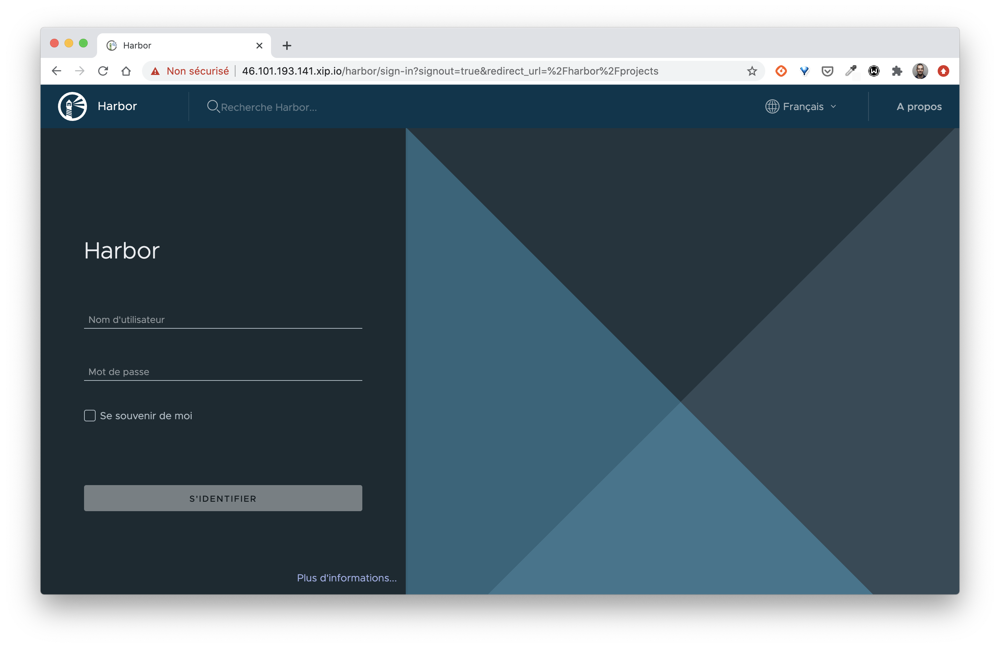
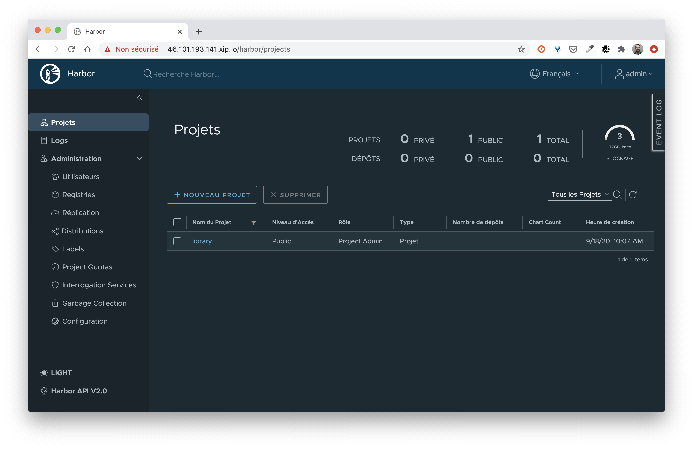
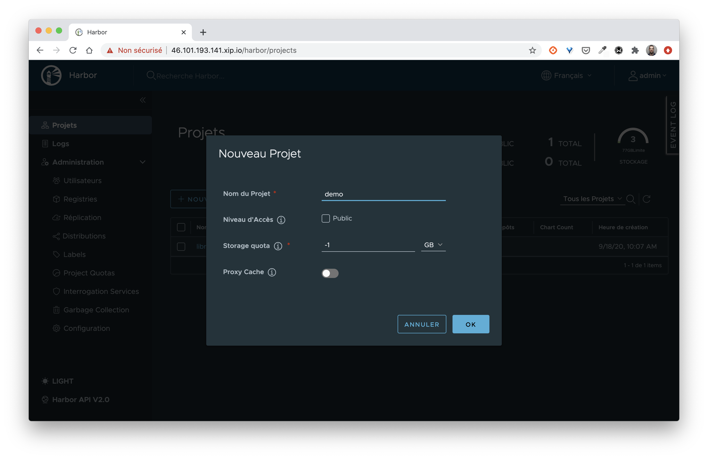
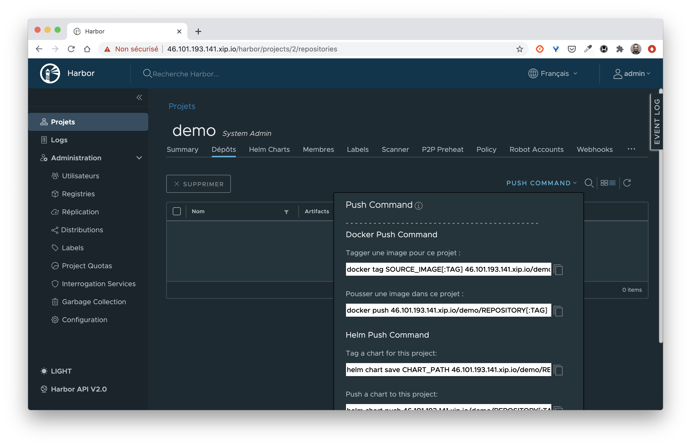
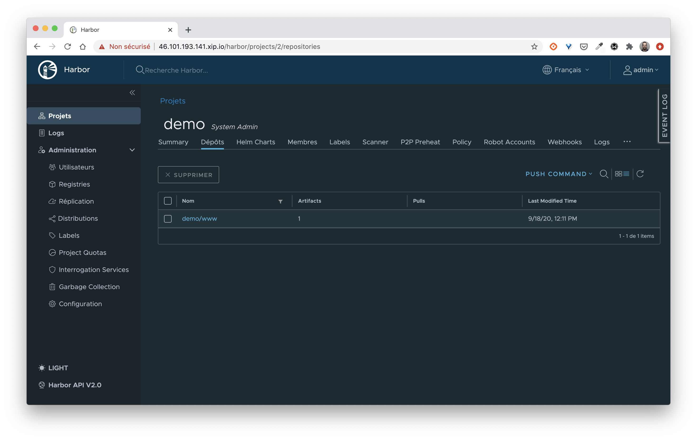
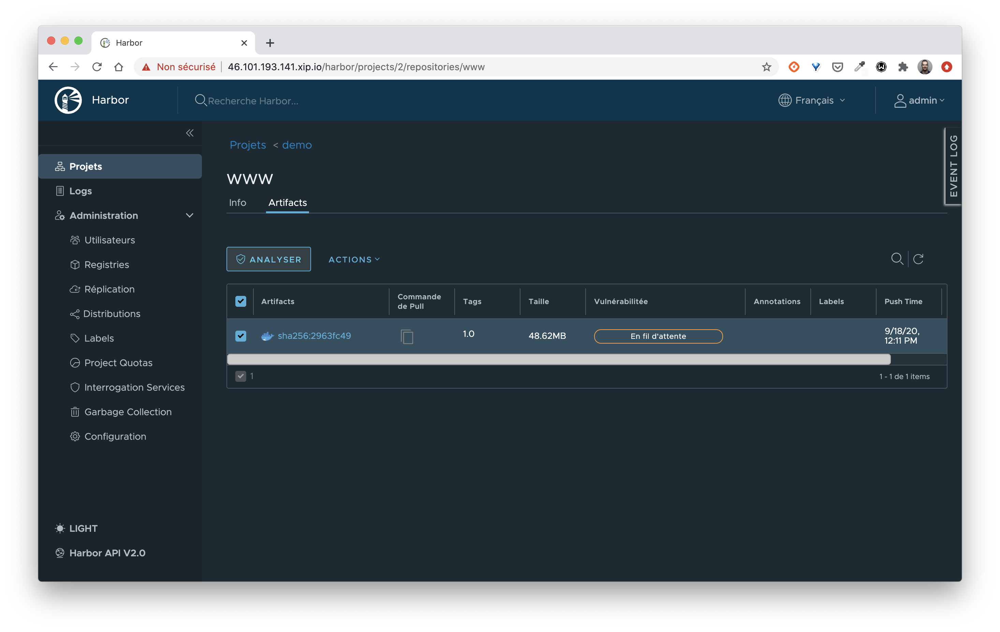
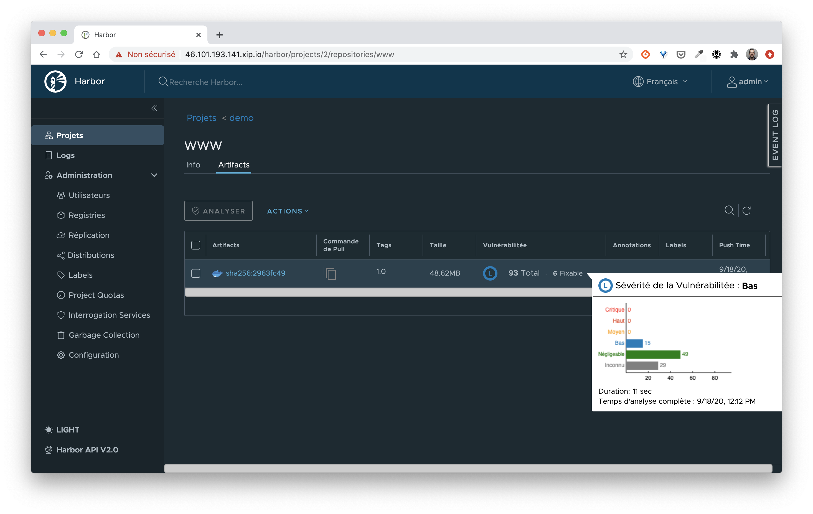
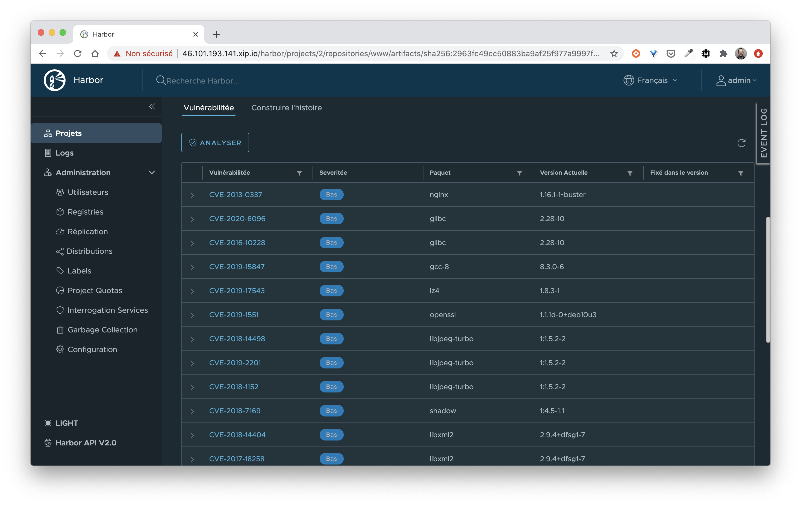

Dans cet exercice vous allez mettre en place *Harbor*, un registry open-source qui permet de distribuer de façon sécurisée différents types d'artefacts (images Docker, Helm charts, ...).

## Présentation

Harbor est un projet gradué de la CNCF. Ses principales fonctionnalités sont les suivantes:

- Container image registry
- Helm repository
- Security & vulnerability analysis
- Content signin & validation
- Multi-tenant
- Image replication
- RBAC
- API & Web UI

Harbor est déployé en tant qu'application micro-services composée de:

- Postgresql
- Redis
- Clair
- Chartmuseum
- Docker/distribution
- Docker/notary
- Helm
- Swagger-ui
- Trivy

## Pre-requis

Harbor sera lancé en utilisant Docker Compose, vous aurez donc besoin du binaire *docker-compose*:

- si vous utilisez *Docker for Mac* ou *Docker for Windows*, le binaire *docker-compose* est déjà installé

- si vous utilisez un autre environnement, installez la dernière version de *docker-compose* en suivant les instructions détaillées à l'adresse suivante [https://docs.docker.com/compose/install/](https://docs.docker.com/compose/install/)

Vérifiez que le binaire est correctement installé avec la commande `docker-compose version`.

Note: si vous êtes sur Linux et que la commande *docker-compose* est lente, le workaround suivant pourrait vous aider [https://github.com/docker/compose/issues/6552#issuecomment-529787442](https://github.com/docker/compose/issues/6552#issuecomment-529787442)

## Récupération du package de Harbor

La première étape consiste à télécharger la dernière version de Harbor:

```
$ curl -L https://github.com/goharbor/harbor/releases/download/v2.1.0/harbor-online-installer-v2.1.0.tgz -o harbor.tgz
$ tar xvf harbor.tgz
```

## Configuration

Une fois l'archive extraite, il est nécessaire de modifier certains paramètres de configuration. Commencez par créer le fichier *harbor.yml* à partir du template *harbor.yml.tmpl* fourni.

```
$ cp harbor.yml.tmpl harbor.yml
```

Ensuite, modifiez le contenu de ce fichier, il vous faudra:

- spécifier le *hostname* (vous utiliserez pour cela un domain en `xip.io`)
- mettre en commentaire la configuration https

Le début du fichier *harbor.yml* devrait ressembler à celui ci-dessous (assurez-vous de remplacer HOST_IP par l'adresse IP de la machine sur laquelle vous installez Harbor):

```
# The IP address or hostname to access admin UI and registry service.
# DO NOT use localhost or 127.0.0.1, because Harbor needs to be accessed by external clients.
hostname: HOST_IP.xip.io

# http related config
http:
  # port for http, default is 80. If https enabled, this port will redirect to https port
  port: 80

# https related config
# https:
  # https port for harbor, default is 443
  # port: 443
  # The path of cert and key files for nginx
  # certificate: /your/certificate/path
  # private_key: /your/private/key/path
...
```

Note: la configuration https a été mise en commentaire car nous exposerons Harbor simplement via http. Cela ne pose pas de problème dans le cadre de cet exercice mais pour tout autre utilisation de Harbor il faudra vous assurer de l'exposer via https.

## Installation

Plusieurs options sont disponible lors de l'installation de Harbor:

- --with-notary: Notary permet la création et la vérification de signatures sur les images
- --with-clair: Clair est un scanner de vulnérabilités permettant de détecter des CVE
- --with-trivy: Trivy est également un scanner de vulnérabilités
- --with-chartmuseum: ChartMuseum permet de distribuer des application packagées dans des charts Helm (utilisé dans le monde Kubernetes)

Dans cet exemple, vous allez installer Harbor avec Trivy, Clair et ChartMuseum:
```
$ sudo ./install.sh --with-trivy --with-clair --with-chartmuseum
```

En utilisant le binaire *docker-compose*, vérifiez que les différents composants ont été déployés. Vous devriez obtenir un résultat proche de celui ci-dessous.

```
$ docker-compose ps
Name                     Command                  State                 Ports
---------------------------------------------------------------------------------------------
chartmuseum         ./docker-entrypoint.sh           Up (healthy)
clair               ./docker-entrypoint.sh           Up (healthy)
clair-adapter       /home/clair-adapter/entryp ...   Up (healthy)
harbor-core         /harbor/entrypoint.sh            Up (healthy)
harbor-db           /docker-entrypoint.sh            Up (healthy)
harbor-jobservice   /harbor/entrypoint.sh            Up (healthy)
harbor-log          /bin/sh -c /usr/local/bin/ ...   Up (healthy)   127.0.0.1:1514->10514/tcp
harbor-portal       nginx -g daemon off;             Up (healthy)
nginx               nginx -g daemon off;             Up (healthy)   0.0.0.0:80->8080/tcp
redis               redis-server /etc/redis.conf     Up (healthy)
registry            /home/harbor/entrypoint.sh       Up (healthy)
registryctl         /home/harbor/start.sh            Up (healthy)
trivy-adapter       /home/scanner/entrypoint.sh      Up (healthy)
```

## Accès à l'interface

L'interface est maintenant accessible depuis http://HOST_IP.xip.io

Note: vous devrez remplacer HOST_IP par l'adresse IP de la machine sur laquelle vous installez Harbor



Les identifiants par défaut sont: admin / Harbor12345
Vous accéderez alors au dashboard dans lequel vous verrez le projet *library* créé par défaut.



## Création d'un projet

Vous aller ensuite créer un nouveau projet nommé *demo* en conservant les valeurs par défaut.



Une fois le projet créé, cliquez sur celui-ci, cela vous amènera dans le menu *Dépôts* qui permet de gérer des repositories d'images Docker.

En cliquant sur le bouton *PUSH COMMAND* vous obtiendrez les commandes à utiliser pour envoyer des images dans ce dépot.

.

Pour le moment, il n'est pas encore possible d'envoyer des images car le registry a été mis en place sans TLS. Il faut tout d'abord autoriser le daemon Docker à accéder à ce registry non sécurisé.

## Configuration du daemon Docker

Pour que notre daemon Docker puisse accéder à ce registry (notamment pour y pusher des images), vous allez modifier le contenu du fichier */etc/docker/daemon.json* (il vous faudra créer ce fichier si il n'existe pas) de façon à ce qu'il contienne les instructions suivantes.

```
{
  "insecure-registries": ["HOST_IP.xip.io"]
}
```

Note: comme précédemment, il vous faudra remplacer HOST_IP par l'adresse IP de la machine sur laquelle tourne Harbor

Il est ensuite nécessaire de redémarrer le daemon Docker:
```
$ sudo systemctl restart docker
```

Vous devriez alors pouvoir vous logger sur le registry que vous avez mis en place.

```
$ docker login -u admin HOST_IP.xip.io
Username: admin
Password:
...
Login Succeeded
```

## Envoi d'une image

Vous allez à présent envoyer une image sur le registry. Pour ce faire, vous pouvez utiliser une image que vous avez déjà en local ou bien récupérer une image depuis le Docker Hub. Il faudra ensuite la tagger de façon à lui donner un nom qui permettra de l'envoyer dans un Dépot du projet *demo*.

En utilisant les commandes suivantes, récupèrez l'image *nginx:1.16* puis taggez la de façon à ce qu'elle puisse être envoyée dans le dépot *www* du projet *demo*.

```
$ docker pull nginx:1.16
$ docker image tag nginx:1.16 HOST_IP.xip.io/demo/www:1.0
```

Vous pouvez ensuite envoyer l'image dans Harbor avec la commande suivante:

```
$ docker image push HOST_IP.xip.io
```

Vous obtiendrez un résultat proche de celui ci-dessous:
```
The push refers to repository [HOST_IP.xip.io/demo/www]
c23548ea0b99: Pushed
82068c842707: Pushed
c2adabaecedb: Pushed
1.0: digest: sha256:2963fc49cc50883ba9af25f977a9997ff9af06b45c12d968b7985dc1e9254e4b size: 948
```

Dans l'interface de Harbor, vous pourrez voir que le dépot *www* a été créé dans le projet *demo*. Celui-ci contient un seul artefact (l'image qui vient d'être uploadée).



Cliquez sur ce dépot afin d'obtenir des informations supplémentaires sur cette image.



Sélectionnez ensuite l'image et lancez un scanning de vulnérabilités en cliquant sur le bouton *Analyser*. Après quelques dizaines de secondes vous obtiendrez le résultat du scanning, notamment le nombre de failles détectées ainsi que leur niveau de criticité.





Note: par défaut le scanner utilisé est *Clair*, il est cependant possible d'utiliser *Trivy* à la place, les 2 scanners ayant été déployés lors que vous avez installé Harbor.

Il est important de savoir si une image contient des vulnérabilités, mais il est parfois difficile de savoir si cette image peut être utilisée dans une application. Cela dépend notamment de plusieurs facteurs: est ce que l'application est exposée au monde extérieur ou exécutée uniquement en interne, est ce que la vulnérabilité peut-elle être facilement exploitée, ... ?

## En résumé

Dans cet exercice, vous avez mis en place Harbor un des projets phares de la CNCF. Nous avons seulement illustré quelques unes de ses fonctionnalités, notamment celle du registry d'image de container. N'hésitez pas à naviguer dans son interface pour découvrir plus en détails les différentes fonctionnalités qui sont offertes.
