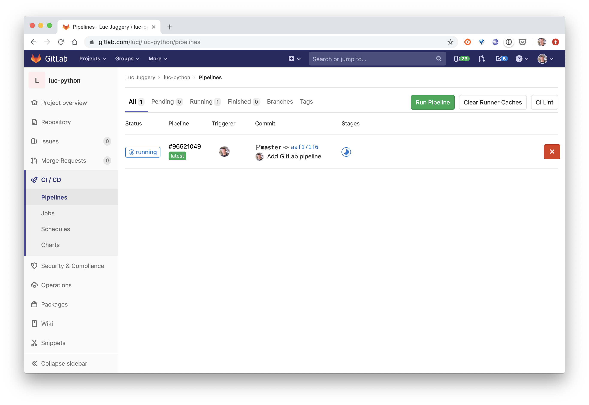
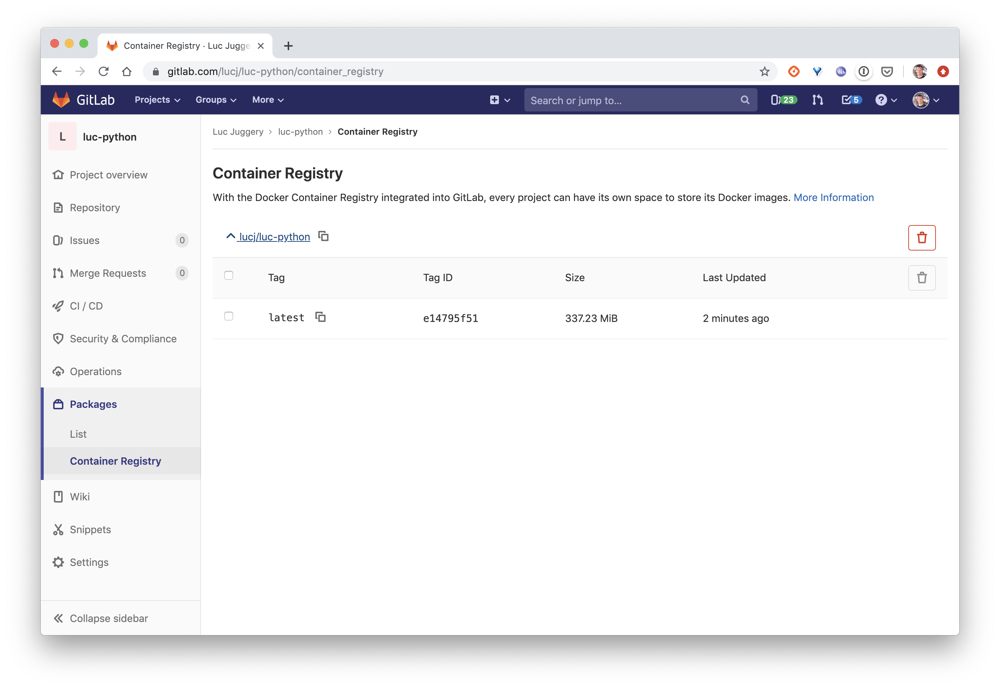

# Setup a Gitlab-CI pipeline

## Create a pipeline that automatically build and package the project

Create a `.gitlab-ci.yml` file in the root directory your project and make sure it contains the following content:

```
stages:
  - package

push image docker:
  image: docker:stable
  stage: package
  services:
    - docker:18-dind
  script:
    - docker build -t $CI_REGISTRY_IMAGE .
    - docker login -u gitlab-ci-token -p $CI_BUILD_TOKEN $CI_REGISTRY
    - docker push $CI_REGISTRY_IMAGE
```

This step defines a CI stage named *package* and a set of instructions to perform the build and push of the image.

Commit and push your changes:

```
$ git add .gitlab-ci.yml
$ git commit -m 'Add GitLab pipeline'
$ git push origin master
```

Go to gitlab and check in the CI/CD page that pipeline is running.



Once finished successfully : within the *Packages -> Container Registry* menu you should see the first image of your application has been build and is now available in the registry.



## Add some integration tests

In the `.gitlab-ci.yml` file, add a new *integration* entry under the *stage* key.

```
stages:
  - package
  - integration
```

At the end of the file, add the following *integration test* step.

```
integration test:
  image: docker:stable
  stage: integration
  services:
    - docker:18-dind
  script:
    - docker run -d --name myapp $CI_REGISTRY_IMAGE
    - sleep 10s
    - TEST_RESULT=$(docker run --link myapp lucj/curl -s http://myapp:8000)
    - echo $TEST_RESULT
    - $([ "$TEST_RESULT" == "Hello World!" ])
```

This step defines a test of the newly created image. It makes sure the web server return the "Hello World!" string.

> For a java project, put a sleep of 20s (!)

Commit and push the update.

```
$ git add .gitlab-ci.yml
$ git commit -m 'Add integration step'
$ git push origin master
```

Then, from the GitLab interface, check the pipeline is running.

You should notice the *integration* step of the job failed.


Check the job's logs to find the bug, fix it, commit an push your changes. Then make sure the job passed this time.

## Automatic deploy to staging

From the *Operations > Environments* menu, Create an environment `staging` in gitlab.


In the `.gitlab-ci.yml` file, add a new *deploy* entry in the *stages* key:

```
stages:
  - package
  - integration
  - deploy
```

At the end of the file, add the following *deploy* step:

```
deploy staging:
  stage: deploy
  script:
    - echo "Deploy to staging server"
  environment:
    name: staging
    url: https://staging.example.com
```

Commit and push the update. Then check the pipeline is running.

Once the pipeline is done, we can have a look to the environment page:


We can see our dummy deployment in there.

## Create a Swarm service

We will now deploy our application as a Docker Service with the following command (replace GITLAB_USER with your GitLab account and GITLAB_REPO with the name of the repository you created in the previous step):

```
$ docker service create \
  --name hi \
  --publish 8080:8000 \
  registry.gitlab.com/GITLAB_USER/GITLAB_REPO:latest
```

Note: the port 8000 of the service is published on the port 8080 as 8000 is already used by Portainer

## Create a Portainer's webhook

From the Portainer's interface, make sure the service is running:


From the service's details, switch ON the *Service webhook* radio button, this will generate an URL that can be called from the outside to trigger the update of the service.


Copy this URL and use its value in the **PORTAINER_WEBHOOK** variable that you create from the **Settings > CI / CD** menu.


## Add automated deployment on Swarm

The next step is to create an environment named production.


Then, add the following step in the *.gitlab-ci.yml* file.

```
deploy-swarm:
  stage: deploy
  image:
  script:
    - apk add --update curl
    - curl -XPOST $PORTAINER_WEBHOOK
  only:
  - master
  environment:
    name: production
```

Make a little change in the application code, for instance modify the string returned (make sure you change the test within *.gitlab-ci.yml* at the same time). Commit and push the changes.

Verify that the new version of the application was successfully deployed.

This is a simple CI/CD example, many additional configuration options could be set to enhance the pipeline (such add the **update parallelism**, **update delay**, ...).
