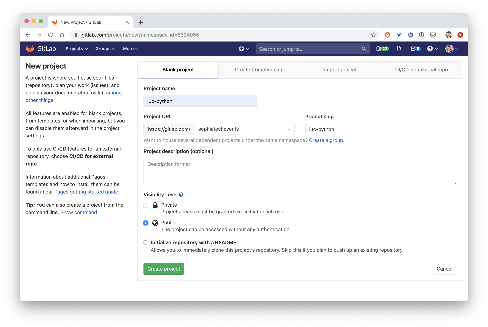

# Push the project to Gitlab

## Setup a Gitlab repository

1. Create an account on Gitlab.com or login if you already have an account.

2. Create a new project 

Name it with your firstname followed by the development language you selected. 

> Make sure to make it **Public** in the *Visibility*.

3. Push your project

Follow the instructions given on the repo landing page "Push an existing folder" in order to push your local project in your new Gitlab repository.

[Let's now setup a Swarm](../04-Swarm)
