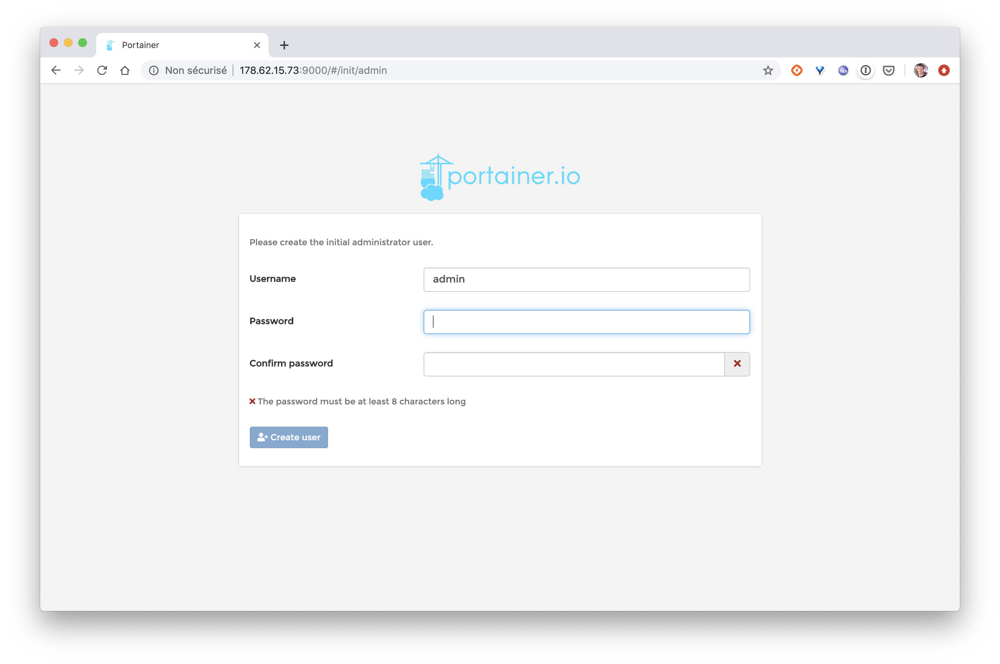
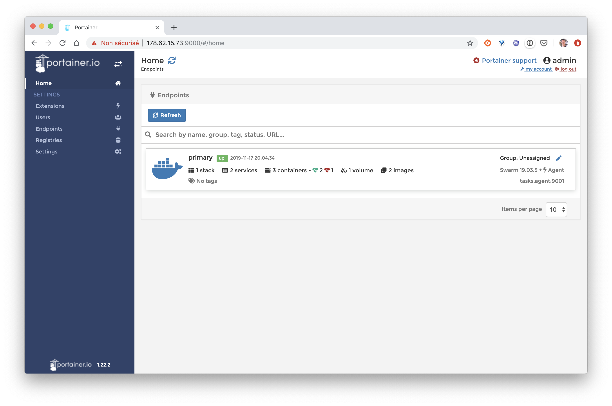
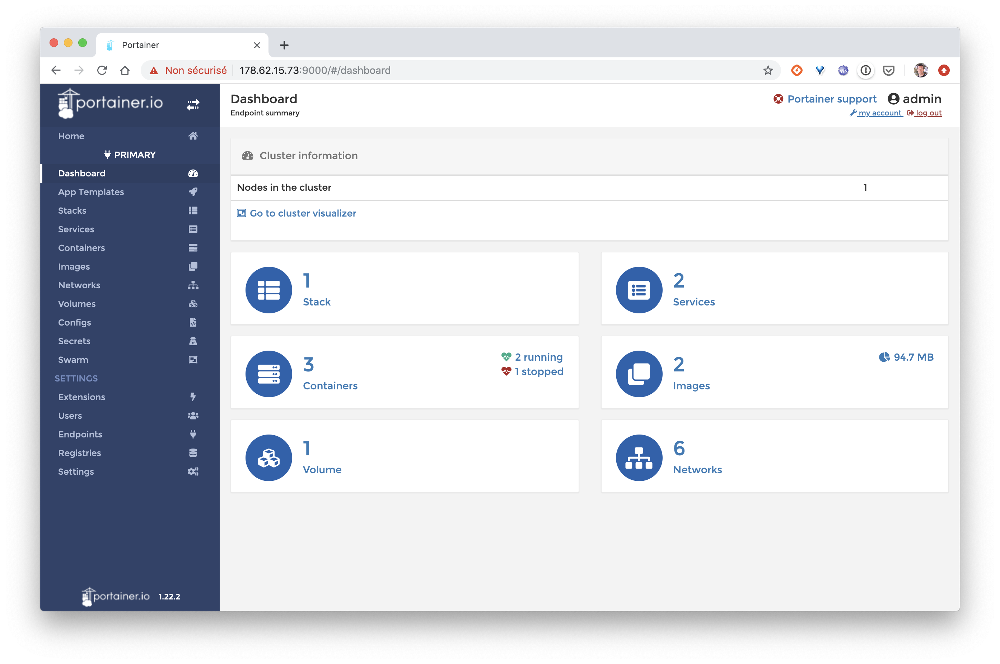

# Swarm

## Setup a Swarm

From a VM running on a cloud provider (so the VM can easily be accssed from the outside), install Docker:

```
$ curl https://get.docker.com | sh
```

and setup a Swarm:

```
$ docker swarm init
```

If you get an error similar to the following one: ```Error response from daemon: could not choose an IP address to advertise since this system has multiple addresses on interface eth0 (178.62.15.73 and 10.16.0.7) - specify one with --advertise-addr```, run the previous command once again providing the external IP address of the node.

Note: if you have several VMs, you can join additional Master / Worker nodes following the instructions provided during the init step

## Install Portainer

From the master VM, get Portainer's Compose file and run the stack:

```
$ curl -L https://downloads.portainer.io/portainer-agent-stack.yml -o portainer-agent-stack.yml
$ docker stack deploy --compose-file=portainer-agent-stack.yml portainer
```

Open a web browser on http://VM_IP_ADDRESS:8080 to make sure Portainer is running



Once you have set a new password for the admin user, you will be able to access Portainer's dashboard.



If you click on the single item of the list, you will see all the entities present in in the Swarm.



[Let's now add a CI/CD pipeline](../05-CICD)
