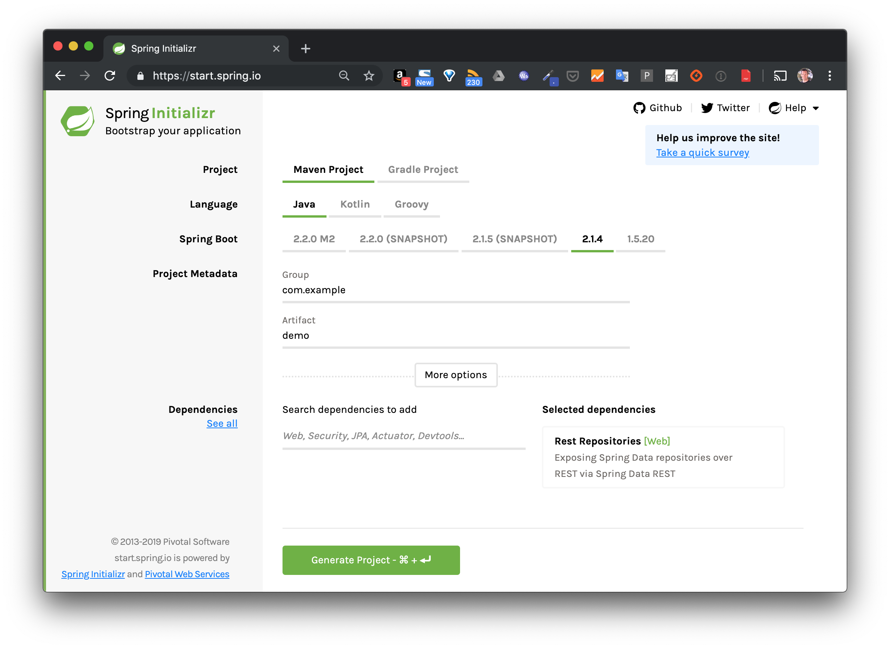

## Skelette d'une application Spring

Généré depuis [https://start.spring.io/](https://start.spring.io/) en utilisant les options suivantes



## Packaging de l'application

```
$ ./mvnw package
```

## Lancement du serveur

```
$ java -jar target/demo-0.1.jar
```

## Test

```
$ curl http://localhost:8080/
hello World
```
